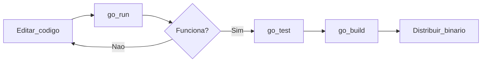

# 08 — Compilar e executar

## `go run` — desenvolvimento rápido

Compila e executa **sem** deixar binário permanente (cache interno):

```powershell
go run .
go run main.go
go run ./1-sortNumber
```

## `go build` — gerar executável

```powershell
go build .                    # binário com nome da pasta (learningGO.exe no Windows)
go build -o meuapp.exe .      # nome customizado
go build ./1-sortNumber       # binário do subpacote
```

O `.exe` aparece na pasta atual (ou no caminho de `-o`).

## `go install` — instalar no GOPATH/bin

```powershell
go install ./cmd/todo
```

Coloca o binário em `$env:GOPATH\bin` (ou `~/go/bin`) — útil para ferramentas CLI globais.

## Flags úteis

| Flag | Efeito |
|------|--------|
| `-o arquivo` | Nome do binário de saída |
| `-v` | Modo verboso (mostra pacotes compilados) |
| `-race` | Detector de race condition (testes e builds) |

## Compilar para outro sistema (cross-compile)

```powershell
$env:GOOS = "linux"
$env:GOARCH = "amd64"
go build -o app-linux .
```

Volte ao normal:

```powershell
Remove-Item Env:GOOS
Remove-Item Env:GOARCH
```

## O que acontece ao compilar?

1. Resolve imports e módulo (`go.mod`)
2. Compila cada pacote
3. Liga tudo em um **binário nativo** (rápido, sem VM)

> **Dica:** Distribua o `.exe` ou binário — o usuário **não** precisa ter Go instalado para **rodar**, só para **desenvolver**.

## Erros comuns de build

| Mensagem | Causa típica |
|----------|----------------|
| `undefined: X` | Typo, import faltando, nome não exportado |
| `imported and not used` | Import sem uso |
| `cannot find module` | `go mod tidy`, caminho errado |
| `function main is undeclared` | Falta `func main()` em `package main` |

## Fluxo de trabalho recomendado



## Prática

1. Gere `hello.exe` com `go build -o hello.exe` a partir do `main.go` da raiz
2. Execute o binário diretamente: `.\hello.exe`
3. Rode `go run ./1-sortNumber` e teste o jogo

## Próximo passo

[09 — Testes](09-testes.md)

[← Índice](README.md)
