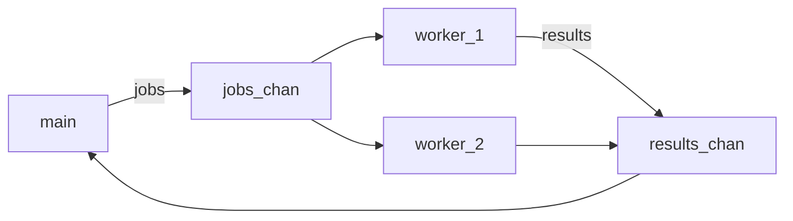

# 11 — Concorrência

Go foi desenhada para programas concorrentes. **Goroutine** = função rodando em paralelo (gerenciada pelo runtime). **Channel** = canal de comunicação entre goroutines.

## Goroutine

```go
import "time"

go func() {
	fmt.Println("rodando em paralelo")
}()

time.Sleep(100 * time.Millisecond) // espera (só para exemplo; use WaitGroup na prática)
```

Prefixo `go` inicia a função sem bloquear a chamada.

## Channels

```go
ch := make(chan int)       // sem buffer
chBuf := make(chan string, 3) // buffer de 3

go func() { ch <- 42 }()   // envia
v := <-ch                   // recebe (bloqueia até ter valor)
```

Fechar canal (quem envia fecha):

```go
close(ch)
v, ok := <-ch  // ok == false se canal fechado e vazio
```

## `select` — múltiplos canais

```go
select {
case msg := <-ch1:
	fmt.Println("ch1:", msg)
case msg := <-ch2:
	fmt.Println("ch2:", msg)
case <-time.After(1 * time.Second):
	fmt.Println("timeout")
default:
	fmt.Println("nenhum pronto")
}
```

## `sync.WaitGroup`

Esperar várias goroutines terminarem:

```go
var wg sync.WaitGroup

for i := 0; i < 3; i++ {
	wg.Add(1)
	go func(n int) {
		defer wg.Done()
		fmt.Println(n)
	}(i)
}

wg.Wait()
fmt.Println("todas terminaram")
```

> **Erro comum:** Capturar variável do loop errada — passe `i` como parâmetro para a closure (como acima).

## Mutex (dados compartilhados)

```go
var mu sync.Mutex
var contador int

func incrementar() {
	mu.Lock()
	contador++
	mu.Unlock()
}
```

> **Idioma Go:** Prefira **passar dados por channels** quando possível; use `Mutex` para estado compartilhado simples.

## Race detector

```powershell
go test -race ./...
go run -race .
```

## Padrão worker (visão geral)



## Prática

1. Lance 5 goroutines que imprimem seu ID e use `WaitGroup`
2. Crie canal de strings, envie 3 mensagens de uma goroutine e receba na `main`
3. Rode `go run -race` em código com contador compartilhado sem mutex e corrija

## Próximo passo

[12 — HTTP básico](12-http-basico.md)

[← Índice](README.md)
