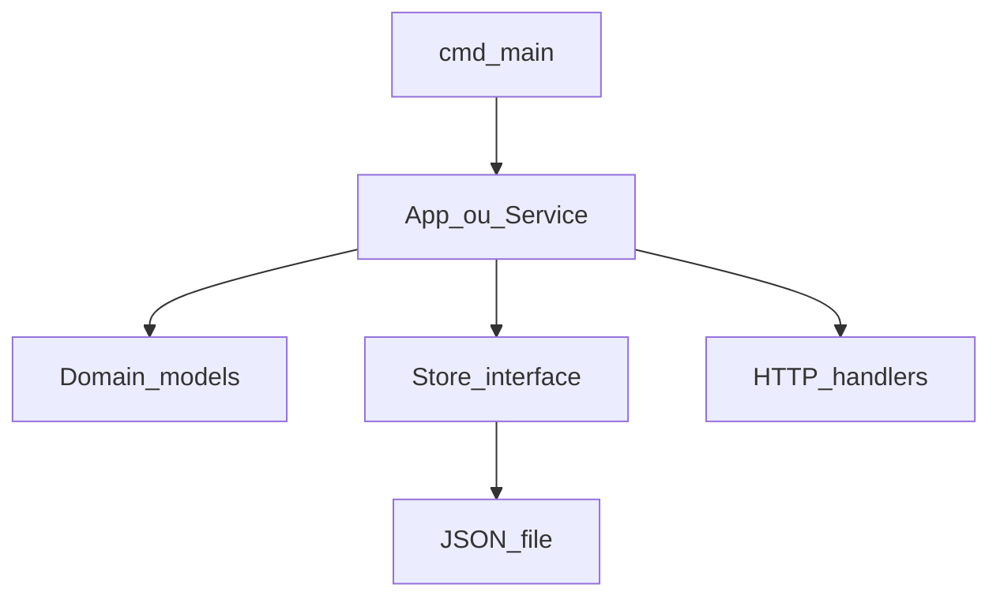

# 13 — Layout de projeto

Quando o programa cresce, organizar pastas evita um único `main.go` gigante.

## Layout idiomático (médio porte)

```
meuapp/
├── go.mod
├── README.md
├── cmd/
│   └── todo/
│       └── main.go          # package main — poucas linhas
├── internal/
│   └── todo/
│       ├── todo.go          # tipos e lógica
│       ├── todo_test.go
│       └── store_json.go    # persistência
└── api/                     # opcional: só HTTP
    └── server.go
```

| Pasta | Uso |
|-------|-----|
| **cmd/** | Um subdiretório por executável (`cmd/todo`, `cmd/worker`) |
| **internal/** | Código privado do módulo (Go impede import externo) |
| **pkg/** | Biblioteca reutilizável **por outros projetos** (use só se fizer sentido) |

## `main` fino

`cmd/todo/main.go` só orquestra:

```go
package main

import (
	"LearningGo/internal/todo"
	"os"
)

func main() {
	store := todo.NewJSONStore("tarefas.json")
	app := todo.NewApp(store)
	if err := app.RunCLI(os.Args); err != nil {
		os.Exit(1)
	}
}
```

Lógica testável fica em `internal/todo`.

## Configuração

Ordem de preferência:

1. Variáveis de ambiente (`os.Getenv`)
2. Arquivo de config (JSON, YAML) — pacote externo ou manual
3. Flags (`flag` da stdlib)

```go
port := os.Getenv("PORT")
if port == "" {
	port = "8080"
}
```

## Separação de responsabilidades



- **Domain:** structs e regras (`Tarefa`, validar título)
- **Store:** interface `Salvar`, `Listar` — facilita testes com mock
- **HTTP/CLI:** camadas finas que chamam o App

## Interface de persistência (exemplo)

```go
type Store interface {
	Listar() ([]Tarefa, error)
	Adicionar(t Tarefa) error
	MarcarFeita(id int) error
}
```

Testes usam implementação em memória; produção usa JSON em disco.

## README do aplicativo

Inclua no README do projeto:

- Como instalar dependências (`go mod download`)
- Como rodar (`go run ./cmd/todo`)
- Como testar (`go test ./...`)
- Variáveis de ambiente
- Exemplo de API (curl)

## Prática

1. Esboce pastas `cmd/` e `internal/` para um app de lista de compras
2. Liste 3 funções que ficariam em `main` vs `internal`
3. Defina interface `Store` com 2 métodos para suas entidades

## Próximo passo

[14 — Projeto completo](14-projeto-completo.md)

[← Índice](README.md)
